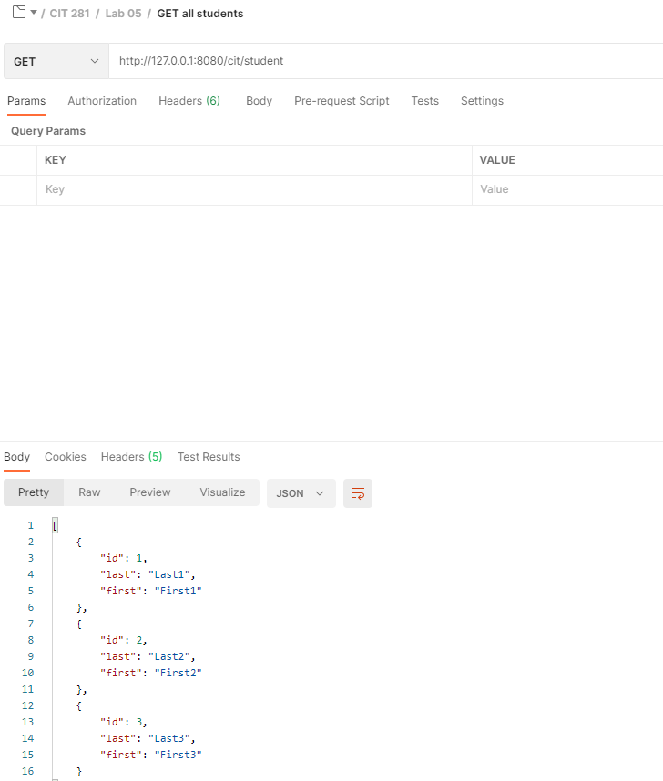
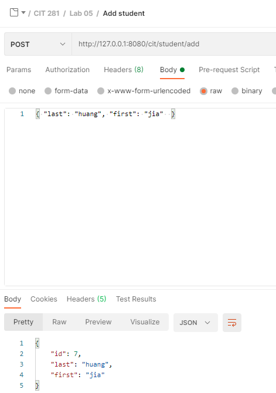

## Purpose

- Use Postmant to organize API requests by creating collections and folders
- Test server application with GET and respond with JSON on Postman
- Add POST handling to server application that responds with JSON and use Postman to POST requests to test application

GET response on Postman  

POST request on Postman  
  

[server application code](https://github.com/Jiah-design/cit281-lab5/blob/main/fastify-server.js)

